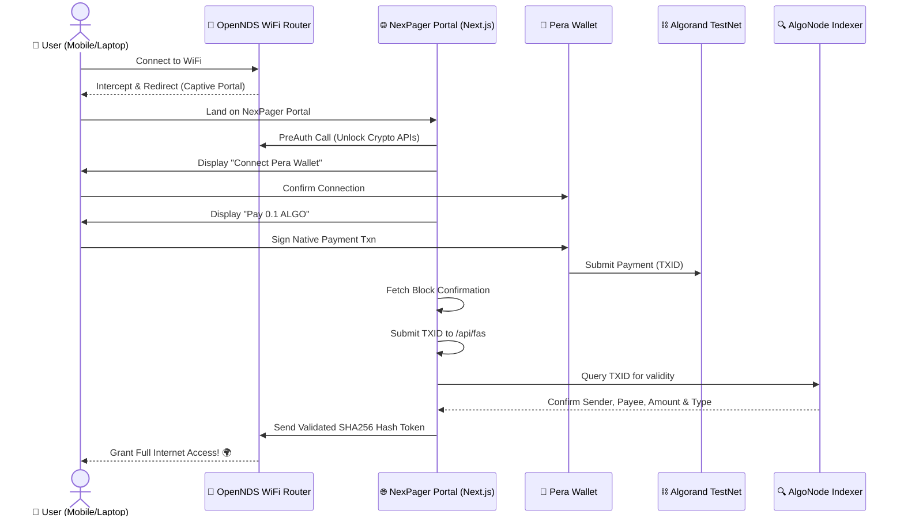

# 📶 NexPager: Crypto-Native WiFi Captive Portal

[](https://testnet.algoexplorer.io/)
[](https://nextjs.org/)
[](https://developer.algorand.org/docs/features/asc1/teal/pyteal/)
[](https://opennds.readthedocs.io/)

## 📖 Overview

**NexPager** leverages Web3 technologies and Algorand smart contracts to create a fully decentralized captive portal for WiFi authentication. By eliminating the need for traditional credit card gateways or localized user credentials, NexPager allows users to authenticate and seamlessly pay for premium internet access natively using **Algorand TestNet ALGOs** via their **Pera Wallet**.

If you've ever wanted a true "Pay-As-You-Go" crypto model for public WiFi (e.g., at coffee shops, venues, airports, or events), NexPager brings that vision to life.

---

## 🏗️ Architecture & Workflow

NexPager bridges physical networking components (OpenNDS running on a Raspberry Pi or OpenWrt router) with a full-stack Next.js application and the Algorand Blockchain.

### 🔄 The x402 Payment Flow Diagram

> **💡 Note for VS Code Users:** To see this diagram rendered as an image instead of code, press `Ctrl + Shift + V` (Windows/Linux) or `Cmd + Shift + V` (Mac), or right-click this file tab and select **"Open Preview"**.



---

## 🛠️ Technical Components

### 1. The Captive Portal Frontend (Next.js + React)
- Intercepts users routed from the OpenNDS Gateway.
- Uses `@perawallet/connect` to securely deep-link or render QR codes so users can sign transactions.
- Uses `algosdk` to build native `pay` transactions dynamically.

### 2. The Verification Backend (Next.js API Routes)
- `/api/fas/auth`: Hits the physical router's `preauth` endpoint to temporarily allow the user's IP to access Algorand node infrastructure before they fully pay.
- `/api/fas`: The core cryptographic validator. Uses the **AlgoNode TestNet Indexer** to scrape the blockchain for the exact `txid` submitted by the user. It verifies the receiver matches the venue's configured wallet, the amount is correct, and the transaction is a valid `pay` transfer. Then, it securely signs an authorization payload and redirects the user to the OpenNDS gateway to unlock their internet.

### 3. Smart Contracts (PyTeal / AlgoKit)
While the captive portal currently verifies fast native ALGO transfers via the Indexer, the repository includes a complete **PyTeal Smart Contract** (App ID: `758808363`).
- **`configure_wifi`:** Allows the Venue/Creator to safely store their payee address, minimum required payment, and specific Asset IDs (for NFT-based access) on-chain.
- **`record_session`:** An immutable ledger function that tracks users, amounts paid, payment references, and increments a global session counter.
- **Deployment Script:** A seamless Python script located at `contracts/scripts/deploy_testnet.py` automatically generates a dev account, waits for an ALGO deposit, compiles the PyTeal to TEAL bytecodes, and deploys it to the TestNet.

### 4. Physical Infrastructure (Raspberry Pi & OpenNDS)
- Uses `hostapd` for the wireless access point and `dnsmasq` for DHCP.
- **OpenNDS** serves as the Forward Authentication Service (FAS) enforcing firewall rules until the NexPager portal issues the cryptographically signed `tok`.

---

## 📜 Deployed Smart Contracts

Here are the live Algorand TestNet contracts deployed for this project:

### 1. Escrow Smart Contract (Current Active)
Locks ALGOs securely on-chain. Only the designated Venue Owner (contract creator) can withdraw funds via InnerTxn.
- **Contract Code:** `escrow_contract.py`
- **TestNet App ID:** `758822640`
- **Explorer Link:** [View on Pera Explorer](https://testnet.explorer.perawallet.app/application/758822640/)

### 2. Analytics & Tracking Contract
An immutable ledger function that tracks users, amounts paid, payment references, and increments a global session counter.
- **Contract Code:** `tracking_contract.py`
- **TestNet App ID:** `758808363`
- **Explorer Link:** [View on Pera Explorer](https://testnet.explorer.perawallet.app/application/758808363/)

---

## 🚀 Quick Start (Local Development)

### 1. Environment Setup

Clone the `.env.example` to `.env.local` in the `nexpager-main` directory:

```env
NEXT_PUBLIC_X402_PAYEE_ADDRESS=TKUTQNBZAMY26ZT6AYRX26556WUYCB65I5QLUHB6NPY6ZDKYD7VZECHPMU
NEXT_PUBLIC_ALGOD_TESTNET_URL=https://testnet-api.algonode.cloud
NEXT_PUBLIC_INDEXER_TESTNET_URL=https://testnet-idx.algonode.cloud
NEXT_PUBLIC_X402_REDIRECT_URL=https://www.google.com
```

### 2. Running NexPager

```bash
cd nexpager-main
npm install
npm run dev
```

Visit `http://localhost:3000` in an **Incognito/Private Browser Window** (to prevent crypto wallet extensions from hijacking the Next.js renderer). 

*Note: If you run locally without connecting to the physical OpenNDS router, the backend API endpoints will automatically fall back to "Mock Auth" mode, bypassing the router checks but fully executing the blockchain logic.*

### 3. Smart Contract Deployment

If you want to deploy a fresh instance of the NexPager tracking contract:

```bash
cd contracts
python -m venv venv
# On Windows: .\venv\Scripts\activate
# On Mac/Linux: source venv/bin/activate
pip install -e .
python scripts/deploy_testnet.py
```
1. It will print a fresh TestNet Wallet address.
2. Send >= 1 ALGO to that address via the Algorand TestNet Dispenser.
3. The script will automatically compile and deploy your contract!

---

## 📹 Demo
[Original Architectural Concept & Demo Video](https://www.loom.com/share/05e377af44174fc4b6e9823f67ba60e9?sid=06403338-0b7b-48ca-b0fa-bb3f1541aadb)

---

*Built for the decentralized future.* 🌍📶


